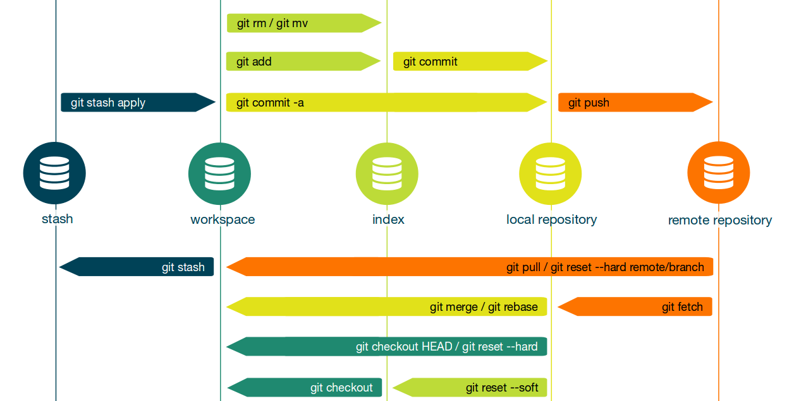

# Basic git commands

## Basic commands

Here are some basic GIT commands you need to know:

git init will create a new local GIT repository. The following Git command will create a repository in the current directory:

    git init

Alternatively, you can create a repository within a new directory by specifying the project name:

    git init [project name]

git clone is used to copy a repository. If the repository lies on a remote server, use:

    git clone username@host:/path/to/repository

Conversely, run the following basic Git command to copy a local repository:

    git clone /path/to/repository

git config can be used to set user-specific configuration values like email, username, file format, and so on. To illustrate, the command for setting up an email will look like this:

    git config --global user.email youremail@example.com

The –global flag tells GIT that you’re going to use that email for all local repositories. If you want to use different emails for different repositories, use the command below:

    git config --local user.email youremail@example.com

git status displays the list of changed files together with the files that are yet to be staged or committed.

    git status

git add is used to add files to the staging area. For example, the basic Git following command will index the to_add.txt file:

    git add <to_add.txt>

git rm is used to remove files to the staging area. For example, the basic Git following command will remove file to_remove.txt from index:

    git rm <to_remove.txt>

git commit will create a snapshot of the changes and save it to the git directory.

    git commit –m “Message to go with the commit here”

    **Note that any committed changes won’t make their way to the remote repository.**

git push is used to send local commits to the master branch of the remote repository. Here’s the basic code structure:

    git push origin <master>

    **Replace <master> with the branch where you want to push your changes.**

git branch will list, create, or delete branches. For instance, if you want to list all the branches present in the repository, the command should look like this:

    git branch

If you want to delete a branch, use:

    git branch –d <branch-name>

git checkout creates branches and helps you to navigate between them. For example, the following basic Git command creates a new branch and automatically switches you to it:

    git checkout -b <branch-name>

To switch from one branch to another, simply use:

    git checkout <branch-name>

git pull merges all the changes present in the remote repository to the local working directory.

    git pull

git merge is used to merge a branch into the active one.

    git merge <branch-name>

git diff lists down changes. In order to view changes against the base file, use

    git diff --base <file-name>

The following basic Git command is used to view the changes between branches before merging them:

    git diff <source-branch> <target-branch>

To list down all the present changes, use:

    git diff

git tag marks specific commits.  Developers usually use it to mark release points like v1.0 and v2.0.

    git tag <insert-commitID-here>

    **Note that tags must be pushed to remote repository with 'git push --tags'**

git log is used to see the repository’s history by listing certain commit’s details. Running the command will get you an output that looks like this:

    git log
        commit 6f0f274edee0a1e41e65dc91ed7c80d42ab5e2dd
        Merge: 9b7cece a45fe39
        Author: omyoneD <omarsanchez@datiobd.com>
        Date:   Wed Feb 12 17:39:33 2020 +0100

            Merge pull request #3 from omyoneD/feature/new_version

            feature for version 0.0.2

        commit a45fe3996808b1eb23136174921ee6697e3760b0
        Author: OmyOneD <omarsanchez@datiobd.com>
        Date:   Wed Feb 12 15:41:57 2020 +0100

            feature for version 0.0.2

        commit 9b7ceceb3502cb7658cec5942c9db9e93f957f38
        ...

git reset command will reset the index and the working directory to the last commit’s state.

    git reset --hard HEAD

git stash command will temporarily save the changes that are not ready to be committed. That way, you can go back to that project later on.

    git stash

git stash could store more than one changes. The way to see all stored changes is:

    git stash list

        stash@{0}: WIP on feature/basic_commands: 5b7d30a modif del ignores
        stash@{1}: WIP on feature/basic_commands: 5b7d30a modif del ignores

git stash apply is used to recover stored changes from stash. If parameter is not defined apply use last stashed changes.

    git stash apply [stash@{N}]

git show is a command  used to view information about any git object.

    git show

git fetch allows users to fetch all objects from the remote repository that don’t currently reside in the local working directory.

    git fetch origin

git rebase is used to apply certain changes from one branch to another. For instance:

    git rebase master

